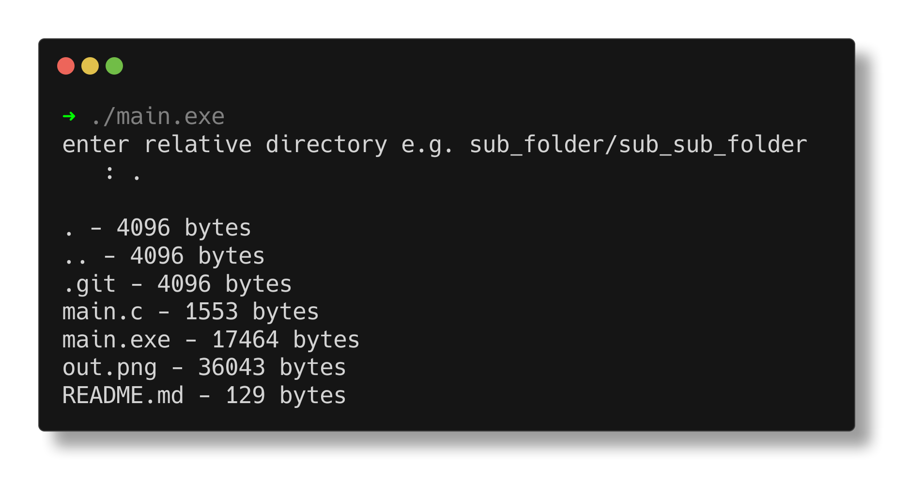

# lsize
An alternative for the "ls" command in linux that lists files with their file size and also allows for relative scanning

Instructions:

    - to run (gcc/linux)
        - chmod +x main.exe
        - ./main.exe

